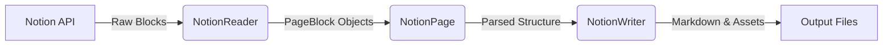

# NotionDown Technical Documentation

## 1. Introduction

NotionDown is a Python-based tool designed to bridge the gap between writing in Notion and publishing static websites (specifically Hexo). It allows users to maintain their content in Notion while automatically generating Markdown files and static site assets.

**Key Features:**
-   **Notion to Markdown:** Converts Notion pages and blocks into standard Markdown.
-   **Hexo Integration:** Optimized for Hexo, including front-matter generation and directory structure management.
-   **Asset Management:** Downloads images from Notion and manages local references.
-   **Customizability:** Supports custom block parsing and output formats.

## 2. Architecture Overview

The system follows a linear data flow pipeline:



1.  **Configuration:** `Config` loads settings from CLI arguments, environment variables, or a JSON file.
2.  **Reading:** `NotionReader` uses `notion-py` (unofficial SDK) to fetch page data and recursively retrieve children blocks.
3.  **Parsing:** `NotionPage` parses raw Notion blocks into internal `PageBaseBlock` subclasses (e.g., `PageTextBlock`, `PageImageBlock`).
4.  **Writing:** `NotionWriter` iterates through the parsed blocks and converts them into Markdown strings, handling specific formatting and asset downloading.

## 3. Core Components

### 3.1 NotionReader (`notion_reader.py`)

The `NotionReader` class is responsible for interacting with the Notion API.

-   **`get_client()`**: Singleton pattern to initialize the `NotionClient` with `token_v2`.
-   **`handle_post()`**: The main entry point for batch processing. It reads all pages from the configured `blog_url`.
-   **`_read_post_pages()`**: Recursively traverses the Notion page tree to collect all relevant pages.
-   **`_parse_page(page)`**: Converts a raw Notion `PageBlock` into a `NotionPage` object.

### 3.2 NotionPage (`notion_page.py`)

This file defines the intermediate data structure.

-   **`NotionPage` Class**: Represents a single Notion page. It holds metadata (title, date, properties) and a list of `blocks`.
    -   **`parse(page)`**: Iterates through raw children blocks and dispatches them to specific parsers (e.g., `_parse_text`, `_parse_image`).
    -   **`properties`**: Extracts custom properties defined in Notion (e.g., `[notion-down-properties]`) which are used for Hexo front-matter.
-   **`PageBaseBlock` & Subclasses**:
    -   `PageTextBlock`, `PageImageBlock`, `PageCodeBlock`, `PageTableBlock`, etc., represent specific content types.
    -   **`write_block()`**: Each block class implements this method to define how it should be rendered in Markdown.

### 3.3 NotionWriter (`notion_writer.py`)

The `NotionWriter` handles the final output generation.

-   **`NotionWriter` Factory**: `get_page_writer(writer)` returns the appropriate writer instance (default `NotionPageWriter` or `HexoWriter`).
-   **`NotionPageWriter`**: Standard Markdown generator.
    -   **`write_page(notion_page)`**: Orchestrates the writing process: Header -> Blocks -> Tail.
    -   **`_write_curr_block`**: recursive function to handle nested blocks (like lists or columns).
    -   **`ImageDownloader`**: Helper class to download images and replace remote URLs with local paths.
-   **`HexoWriter`**: Extends `NotionPageWriter` to add Hexo-specific features.
    -   **`_write_front_matter`**: Generates YAML front-matter from `notion_page.properties`.
    -   **`_configure_file_path`**: Determines the output path based on Hexo conventions (`_posts` vs `_drafts`).

### 3.4 Configuration (`config.py`)

Configuration is managed by the `Config` class with a strict priority order:
1.  **CLI Arguments**: Highest priority (e.g., `--blog_url`).
2.  **Config File**: JSON file specified by `--config_file`.
3.  **Environment Variables**: `NOTION_TOKEN_V2`, `NOTION_BLOG_URL`, etc.
4.  **Defaults**: Hardcoded default values.

## 4. Key Workflows

### 4.1 Parsing Process
When `NotionReader` reads a page:
1.  It identifies the block type.
2.  It looks up the mapping in `NotionPage.mapping`.
3.  It calls the corresponding `_parse_*` method.
4.  The method creates a `Page*Block` instance, populates it with data, and appends it to `notion_page.blocks`.
5.  Special handling exists for "Short Codes" (custom commands embedded in Notion text) to create `PageShortCodeBlock` or `PageChannelBlock`.

### 4.2 Writing Process
When `NotionWriter` writes a page:
1.  It creates a file at the calculated path.
2.  It iterates through `notion_page.blocks`.
3.  For each block, it calls `block.write_block()`.
4.  If the block is an image and `download_image` is enabled, `ImageDownloader` fetches the file and returns a relative path.
5.  `PageBlockJoiner` determines if extra newlines are needed between blocks (e.g., between a list and a paragraph).

### 4.3 Hexo Integration
To use NotionDown with Hexo:
1.  Set `writer` config to `hexo`.
2.  In Notion, add a code block with `[notion-down-properties]` to define metadata like:
    ```text
    [notion-down-properties]
    Title = My Post
    Date = 2023-01-01
    Category = Tech
    hexo.layout = post
    ```
3.  `HexoWriter` extracts these properties and formats them into the Markdown file's YAML front-matter.

## 5. Customization & Extension

### Adding a New Block Type
1.  **Define Block Class**: Create a new class inheriting from `PageBaseBlock` in `notion_page.py`. Implement `write_block()`.
2.  **Register Parser**: Add a mapping in `NotionPage.mapping` and implement the `_parse_*` method to populate your new block class.

### Creating a New Writer
1.  **Inherit**: Create a class inheriting from `NotionPageWriter` in `notion_writer.py`.
2.  **Override**: Override `write_page`, `_write_header`, or `_configure_file_path` as needed.
3.  **Register**: Update `NotionWriter.get_page_writer` to return your new writer based on a config string.
